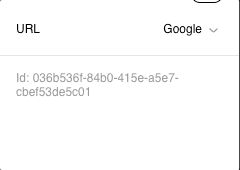

# Custom types

If a built-in set of types (`boolean`, `select`, etc) is not enough you can always create custom ones.

Custom types fall into 3 categories:

- `inline` - a standard type, the value will be stored in a NoCode Entry.
- `token` - similar to `inline` but allows for adding tokens (predefined values like in a built-in `color` or `font`).
- `external` - a special type that allows for connecting dynamic data (not stored in a NoCode Entry, but fetched each time the document is rendered)

To create a custom type you have to define it within [types](configuration.md#config.types) property of your configuration.

### Inline type

Below we're defining a custom type `url`:

```javascript
const easyblocksConfig: Config = {
  ...,
  types: {
    url: {
      type: "inline",
      widget: {
        id: "url",
        label: "URL"
      },
      defaultValue: "https://easyblocks.io"
    }
  }
}
```

`defaultValue` and `widget` properties are mandatory.

Now let's define the widget UI component responsible for displaying the value for `url` field type and updating it:

```tsx
import { InlineTypeWidgetComponentProps } from "@easyblocks/core";
import { Input } from "@easyblocks/design-system";
import { useEffect, useState } from "react";

function UrlWidget(props: InlineTypeWidgetComponentProps<string>) {
  const [active, setActive] = useState(false);
  const [value, setValue] = useState(props.value);

  useEffect(() => {
    if (!active) {
      setValue(props.value);
    }
  });

  return (
    <Input
      value={value}
      onChange={(event) => {
        setActive(true);
        setValue(event.target.value);
      }}
      onBlur={() => {
        setActive(false);
        props.onChange(value);
      }}
      align={"right"}
    />
  );
}

export { UrlWidget };
```

For `url` type we render a text input component from our design system package that displays value of state variable `value` that's based on the prop `value`. When we blur the input, we call `onChange` callback passed in the props to update the property value in a NoCode Entry.

We must also tell editor to render `UrlWidget` component when showing `url` field. To do this, we pass the component to `widgets` prop of `EasyblocksEditor`:

```tsx
import { UrlWidget } from "./path-to-url-widget";

<EasyblocksEditor
  ...,
  widgets={{
    // Property key MUST match the id specified witin the type's declaration
    url: UrlWidget
  }}
/>
```

It's a good practice to make sure that a data saved in a NoCode Entry has a correct format. For example, we can make sure that the value for `url` type will always start with `https://` or `http://`. In order to achieve that, let's add a `validate` function to our new type:

```javascript
const easyblocksConfig: Config = {
  ...,
  types: {
    url: {
      type: "inline",
      widget: {
        id: "url",
        label: "URL"
      },
      defaultValue: "https://easyblocks.io",
      validate(value) {
        return (
          typeof value === "string" &&
          (value.startsWith("http://") || value.startsWith("https://"))
        );
      }
    }
  }
}
```

`validate` function is going to be called each time we invoke `onChange` callback passed to our widget component. If value is not a correct URL it won't get updated.

### Token type

Easyblocks comes with predefined types like `color`, `font` or `space`. These types are token types and they only allow you to pick a value based on what you've specified within the [`tokens`](configuration.md#config.tokens) section for given type ex. `color` only allows to select a value defined within `Config.tokens.colors` property.

Every project is different and requires different tokens. Easyblocks allows you to define your own tokens and token types based on that.

```typescript
const easyblocksConfig: Config = {
  ...,
  tokens: {
    urls: [
      {
        id: "google",
        label: "Google",
        value: "https://google.com"
      },
      {
        id: "bing",
        label: "Bing",
        value: "https://bing.com"
      },
      {
        id: "brave",
        label: "Brave",
        value: "https://search.brave.com"
      }
    ]
  },
  types: {
    url: {
      type: "token",
      token: "urls",
      defaultValue: { tokenId: "google" }
    }
  }
}
```

Above snippet of code defines a custom token type `url` that only allows you to choose from three defined values.

<figure><figcaption><p>UI representation for token type url in sidebar</p></figcaption></figure>

By default token types don't require specifying a widget because you'll never use one, only the select with tokens is displayed. However, there are cases where you would like to allow user to enter a custom value that's not available in your tokens. To make it possible we have to tweak `url` type definition a bit:

```typescript
const easyblocksConfig: Config = {
  ...,
  types: {
    url: {
      type: "token",
      token: "urls",
      defaultValue: { tokenId: "google" },
      // Tell Easyblocks editor that your type accepts custom values
      allowCustom: true,
      // and define a custom widget for custom value input
      widget: {
        id: "url_custom",
        label: "URL Custom"
      }
    }
  }
}
```

Now we need to also define a UI responsible for rendering a custom input for `url` type:

```tsx
import type { TokenTypeWidgetComponentProps } from "@easyblocks/core";
import { Input } from "@easyblocks/design-system";
import { useState } from "react";

function validateURL(value: string) {
  return value.startsWith("http://") || value.startsWith("https://");
}

function UrlTokenWidget(props: TokenTypeWidgetComponentProps<string>) {
  const [inputValue, setInputValue] = useState(props.value);

  return (
    <Input
      value={inputValue}
      onChange={(e: React.ChangeEvent<HTMLInputElement>) => {
        setInputValue(e.target.value);
      }}
      onBlur={() => {
        if (!validateURL(inputValue)) {
          return;
        }

        props.onChange(inputValue);
      }}
      align={"right"}
    />
  );
}

export { UrlTokenWidget };
```

And finally, connect the dots and let know editor about `UrlTokenWidget`:

```tsx
import { UrlTokenWidget } from "./path-to-url-token-widget";

<EasyblocksEditor
  ...,
  widgets={{
    // Property key MUST match the id specified witin the type's declaration
    url_custom: UrlTokenWidget
  }}
/>
```

Allowing custom values adds a new option to already available options and when this new value is selected, it renders the supplied custom input widget component.

<figure><figcaption><p>Setting custom value for token type url</p></figcaption></figure>

### External types

Both `inline` and `token` types store the data within NoCode Entry. But what if you wanted to have a type that connects to a data from external system like Shopify? In that case you obviously don't want to store this data directly in a NoCode entry as it would create an unnecessary cache layer that is hard to keep up-to-date. In order to solve this problem Easyblocks provides a special type called `external`. External types store in the NoCode Entry only the identifier of the external data. The real data payload must be provided dynamically via props.

In order to learn about this concept please read [External Data guide](external-data.md).
