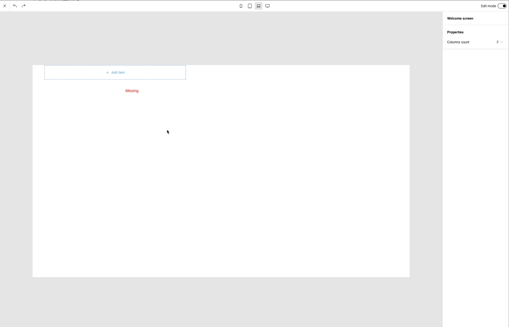
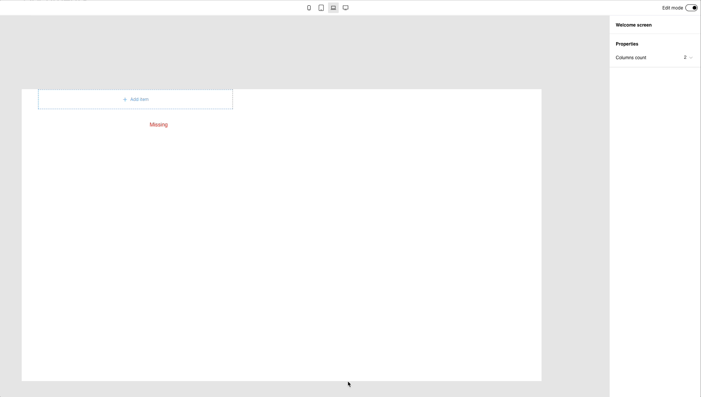

# External data

When you build a custom visual builder you usually want to connect it to the data that is specific to your software. Easyblocks allows for a full control over external data:

1. **Connect any external data source**. You can define your own widget displayed in the editor to pick data entry of any type (for example a product data from e-commerce platform). You define how the data is fetched and from where.
2. **All the data is fully dynamic**. Easyblocks doesn’t store any copies of data inside of its no-code entries. All the data is fetched in your code and provided via `externalData` prop to `EasyblocksEditor` or `Easyblocks` components (for editing and rendering respectively).
3. **Compound data types**. Custom data sources can provide compound objects consisting of multiple "basic" data types like text, image or video. Those basic types can be later connected to text fields, images etc. For example you can create a `product` data source (a product data from e-commerce platform) and then connect `product.title` to a text box or `product.mainImage` to the image component.
4. **Document-level parameters.** Your documents can be rendered with different data thanks to the [root parameters](external-data.md#root-parameters-and-template-system) feature. Imagine you're building an e-commerce platform. Your users want to build a product page template and reuse this template for all the product pages. You can do it by adding a `product` as a root parameter of your document's root component. While editing, users will be able to pick any product data just for preview. When the content is rendered, the product data must be passed dynamically depending on the product page that is being rendered. You can render hundreds of different products pages based on a single template, similar to Shopify Theme Editor. Root parameters allow for building advanced template systems.&#x20;

### Connecting external data sources

Let's imagine we have the following list of products:

```json
[
  {
    "id": "1",
    "title": "Product 1",
    "price": 25.0
  },
  {
    "id": "2",
    "title": "Product 2",
    "price": 10.0
  },
  {
    "id": "3",
    "title": "Product 3",
    "price": 50.0
  },
  {
    "id": "4",
    "title": "Product 4",
    "price": 150.0
  }
]
```

Let's define a new No-Code Component `Product` to display data of single product:

```typescript
{
  id: "Product",
  schema: [
    {
      prop: "product",
      type: "product",
    },
  ]
}
```

As you can see, we've used a new type called `product`. Right now, Easyblocks doesn't know anything about our custom type and will throw an error that it can't find it. To define a custom type you have to add its definition to [types](configuration.md#types) property.

```typescript
const easyblocksConfig: Config = {
  ...,

  // Declarations of custom types
  types: {
    product: {
      type: "external",
      widgets: [],
    }
  }
}
```

Right now, definition of our new `product` type consists only of empty `widgets` array, but we will get back to it soon. If we try to add our `Product` component to the canvas, the error about missing type is gone, but the sidebar won't display our new field because it doesn't know how to do it. Each type can have one or more widgets to tell the editor how to render input/picker for that particular type. Built-in types have their own widgets that aren't overridable right now.

Let's define a new custom widget for our `product` type. Widget's definition is split into two parts:

- defining widget within the definition of type
- supplying React component for rendering within the editor

```tsx
// Widgets definition
const easyblocksConfig: Config = {
  ...,
  types: {
    product: {
      type: "external",
      widgets: [
        {
          id: "product",
          label: "Product"
        }
      ],
    }
  }
}

// Widget's component
import { WidgetComponentProps } from "@easyblocks/core";

function ProductPickerWidget(props: WidgetComponentProps<string>) {
  return null;
}

<EasyblocksEditor
  config={easyblocksConfig}
  widgets={{ product: ProductPickerWidget }}
/>
```

After these changes, our `ProductPickerWidget` is rendered instead of the error message. The problem is that it doesn't do anything. Let's first examine what our component receives in the props object:

- `id` (`string | null`) - a unique identifier of the currently selected resource, in our case it would be product id. This `id` is always stored in a No-Code Entry and will be later used for fetching the data. If `id` equals `null` it means that no resource is picked.
- `onChange ((newId: string | null) => void)` - this callback should be called by widget code to notify Easyblocks that selected resource `id` changed.

Let's implement a simple widget component using `select` element:

```tsx
import { WidgetComponentProps } from "@easyblocks/core";
import { SimplePicker } from "@easyblocks/design-system";

const products = [
  {
    id: "1",
    title: "Product 1",
    price: 25.0,
  },
  {
    id: "2",
    title: "Product 2",
    price: 10.0,
  },
  {
    id: "3",
    title: "Product 3",
    price: 50.0,
  },
  {
    id: "4",
    title: "Product 4",
    price: 150.0,
  },
];

function ProductPickerWidget(props: WidgetComponentProps<string>) {
  return (
    <select
      value={props.id ?? ""}
      onChange={(event) => {
        props.onChange(event.target.value === "" ? null : event.target.value);
      }}
    >
      <option value={""}>Select a product</option>
      {products.map((p) => (
        <option value={p.id} key={p.id}>
          {p.title}
        </option>
      ))}
    </select>
  );
}
```

Out widget component simply renders all products as available options and an additional option for empty value. Selecting `Product` component on the canvas gives us now the access to our custom widget picker from the sidebar.

<figure><figcaption></figcaption></figure>

The only things stored in No-Code Entry are unique `id` and `widgetId`:

```json
{
  "product": {
    "id": "3",
    "widgetId": "product"
  }
}
```

As you can see we don't store a full product object in a No-Code Entry. The full data will be provided dynamically.

The missing piece right now is displaying the selected product. Let's implement React component for our `Product` component now:

<pre class="language-tsx"><code class="lang-tsx"><strong>function Product({ product }: ProductProps) {
</strong>  return (
    &#x3C;div>
      &#x3C;h1>{product.title}&#x3C;/h1>
      &#x3C;p>{product.price}&#x3C;/p>
    &#x3C;/div>
  );
}

// Editor component
&#x3C;EasyblocksEditor
  config={easyblocksConfig}
  components={{ Product }}
  widgets={{ product: ProductPickerWidget }}
/>
</code></pre>

If we try to render `Product` component with empty `product` field we will see the following message instead of our component:

<figure><figcaption></figcaption></figure>

This happens because by default each custom type field is **required**, which means that Easyblocks doesn't render the component until some value is selected (this can be changed with `optional` property).

However, even if you select a value for `product` field, the component still won't render. It happens because Easyblocks doesn't yet know how to fetch the actual data. To resolve this issue we need to define a custom fetcher. Fetcher is a function that receives external references stored within No-Code Entry and resolves them to their external data. To define a fetcher for editor you need to specify `onExternalDataChange` prop.

<pre class="language-tsx"><code class="lang-tsx"><strong>import { ExternalData } from '@easyblocks/core';
</strong><strong>
</strong><strong>// State variable for storing fetched external data during editing
</strong><strong>const [externalDataValues, setExternalDataValues] = useState&#x3C;ExternalData>(
</strong>  {}
);
<strong>
</strong><strong>&#x3C;EasyblocksEditor
</strong>  config={easyblocksConfig}
  externalData={externalDataValues}
  onExternalDataChange={async externals => {
    // fetch external data
  }} 
  components={{ Product }}
  widgets={{ product: ProductPickerWidget }}
/>
</code></pre>

That callback is invoked each time you update value for your custom type field. The `changedExternalData` parameter has the following structure:

```javascript
{
  "606106b5-86e3-4234-aa23-11d8191e6ab8.product": {
    id: "3",
    type: "product",
    widgetId: "product"
  }
}
```

Each property represents a field of your defined custom type that was recently updated and its value represents the external reference to some external data. To correctly resolve`product` type references we need to do the following:

1. from `externals` select only types of `product`
2. map each external reference to its related external data value
3. return resolved external data in the valid format

```tsx
const products = [
  {
    id: "1",
    title: "Product 1",
    price: 25.0,
  },
  {
    id: "2",
    title: "Product 2",
    price: 10.0,
  },
  {
    id: "3",
    title: "Product 3",
    price: 50.0,
  },
  {
    id: "4",
    title: "Product 4",
    price: 150.0,
  },
];

const [externalDataValues, setExternalDataValues] = useState<ExternalData>(
  {}
);

<EasyblocksEditor
  ...,
  onExternalDataChange={async externals => {
    // (1)
    const productReferences = Object.entries(externals)
      .filter(([, reference]) => {
        // Why do we check `widgetId` instead of `type`?
        // We could rely on `type` field, but we could have multiple widgets for
        // the same type and they could be resolved differently.
        // Why do we check for empty `id`?
        // Changing from non empty value to empty is also a change
        return reference.widgetId === 'product' && reference.id !== null;
      });

    const resolvedProducts = Object.fromEntries(
      productReferences.map(([id, reference]) => {
        // (2)
        const product = products.find(p => p.id === reference.id);

        // (3)
        if (!product) {
          // If product wasn't resolved/found, we report an error
          return [id, { error: new Error(
            `Product with id ${reference.id} was not found`
          )}]
        }

        // (3) If found, return it as resolved external data
        return [id, { type: 'product', value: product }];
    }));

    // We inform editor about change by updating `externalDataValues` state variable
    // with new data
    setExternalDataValues({
      ...externalDataValues,
      ...resolvedProducts
    });
  }}
/>
```

And here is the result component finally rendered with the external data :tada:

<figure><figcaption></figcaption></figure>

### Built-in picker

To build a simple usable widget component, Easyblocks comes with `SimplePicker` component that can be imported from `@easyblocks/design-system` package. It comes with built-in support for:

- displaying available options from async source
- searching through available options based on given search criteria
- clearing selected value
- displaying preview image of each option

&#x20;Let's use it now instead:

```tsx
import { WidgetComponentProps } from "@easyblocks/core";
import { SimplePicker } from "@easyblocks/design-system";

const products = [
  {
    id: "1",
    title: "Product 1",
    price: 25.0,
  },
  {
    id: "2",
    title: "Product 2",
    price: 10.0,
  },
  {
    id: "3",
    title: "Product 3",
    price: 50.0,
  },
  {
    id: "4",
    title: "Product 4",
    price: 150.0,
  },
];

function ProductPickerWidget(props: WidgetComponentProps) {
  return (
    <SimplePicker
      value={props.id}
      onChange={props.onChange}
      getItems={async (query) => {
        const filteredItems = products.filter((p) => p.title.includes(query));

        return filteredItems.map((i) => {
          return {
            id: i.id,
            name: i.title,
          };
        });
      }}
      getItemById={async (id) => {
        const item = products.find((p) => p.id === id);

        return {
          id: item.id,
          name: item.title,
        };
      }}
    />
  );
}
```

To use `SimplePicker` we need to do the following things:

- forward received `props` as `value` and `onChange`
- implement `getItems` method that's responsible for showing the list of available items to choose from based on entered search text
- implement `getItemById` method that's responsible for fetching data about currently selected item

<figure><figcaption></figcaption></figure>

### Compound types

Easyblocks allows you to return compound data, which is basically a data that consists of multiple "basic" data types. It means that instead of returning:

```typescript
{
   type: "product",
   value: product
}
```

we can return:

```typescript
{
  type: "object",
  value: {
    productTitle: {
      type: "text",
      value: product.title
    },
    productPrimaryImage: {
      // `image` type isn't a part of Easyblocks and it would require to define
      // a custom type
      type: "image",
      value: product.images[0]
    },
    self: {
      type: "product",
      value: product
    }
  ]
}
```

Compound types are useful when working with root parameters.

### Root parameters and template system

So far we've built a content that's static. Static images, static products, static text. Our content isn't reusable. What if we would like to build a product landing page, but feed it with different product each time? That's possible in Easyblocks thanks to root parameters. Root parameters allows you to define fields whose value can be supplied during the rendering of your content.&#x20;

Let's use above `product` type as our example and define a new component `ProductPage`:

```typescript
import type { Config } from "@easyblocks/core";

const easyblocksConfig: Config = {
  ...,
  components: [
    {
      id: "ProductPage",
      schema: [
        {
          prop: "data",
          type: "component-collection",
          accepts: ["item"]
        }
      ],
      rootParams: [
        {
          prop: "product",
          label: "Product",
          widgets: [{
            id: "product",
            label: "Product"
          }]
        },
      ]
    }
  ]
};
```

If we open the editor with search param `rootComponent=ProductPage` we're going to see a `product` field at the root level in the sidebar. Value for this field can be selected using one of the widgets specified in `widgets` field.

<figure><figcaption><p>Root param product shown in the sidebar</p></figcaption></figure>

If we add a `Simple Text` component to the canvas, we will see a new option to change selected widget of the `Text` value property

<figure><figcaption></figcaption></figure>

After selecting `Document data` option, `Text` property now would allow us to be connected to `text` external data returned for the `product` field.

<figure><figcaption></figcaption></figure>

<figure><figcaption></figcaption></figure>

To dynamically render the content with different products we have to overwrite the property `$.product` of `externalData`&#x20;


To dynamically set a value for root parameter we reference it by joining dollar sign and a name of root parameter ex. `$.myRootParameter`


```tsx
import {
  Easyblocks,
  buildDocument,
  RequestedExternalData,
} from "@easyblocks/core";
import { easyblocksConfig } from "./path-to-your-easyblocks-config";

async function myFetcher(externalData: RequestedExternalData) {
  // Your custom fetcher logic
}

function ProductPage({ params }: Record<string, string>) {
  const { renderableDocument, externalData } = await buildDocument({
    documentId: "<DOCUMENT_ID_OF_PRODUCT_PAGE_CONTENT>",
    config: easyblocksConfig,
    locale: "en-US",
  });

  const fetchedExternalData = await myFetcher({
    ...externalData,
    "$.product": {
      ...externalData["$.product"],
      id: params.id,
    },
  });

  return (
    <Easyblocks
      renderableDocument={renderableDocument}
      externalData={fetchedExternalData}
    />
  );
}
```

For each product page, the content build using the editor is going to have different product data based od `params.id`.
