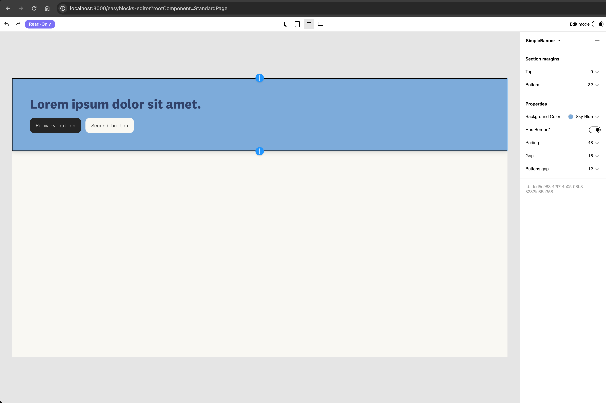
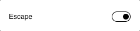
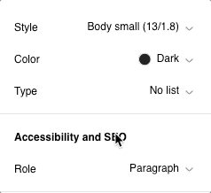
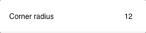
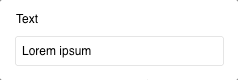
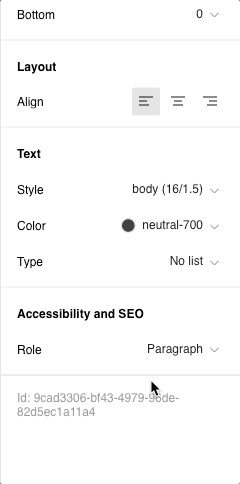
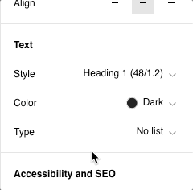
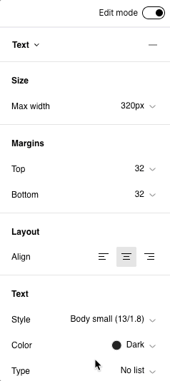
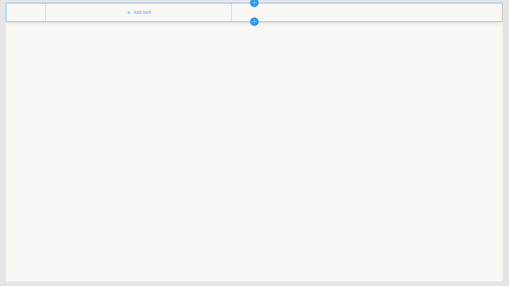

# Schema

Schema is the most important property of a No-Code Component definition. It defines visually editable properties and subcomponents of a No-Code Component.

In our `SimpleBanner` example the schema looks like this:

```typescript
export const simpleBannerDefinition: NoCodeComponentDefinition = {
  // ...,
  schema: [
    {
      prop: "backgroundColor",
      label: "Background Color",
      type: "color",
    },
    {
      prop: "hasBorder",
      label: "Has Border?",
      type: "boolean",
      responsive: true,
    },
    {
      prop: "padding",
      label: "Pading",
      type: "space",
    },
    {
      prop: "gap",
      label: "Gap",
      type: "space",
    },
    {
      prop: "buttonsGap",
      label: "Buttons gap",
      type: "space",
    },
    {
      prop: "Title",
      type: "component",
      required: true,
      accepts: ["@easyblocks/text"],
    },
    {
      prop: "Buttons",
      type: "component-collection",
      accepts: ["Button"],
      placeholderAppearance: {
        height: 36,
        width: 100,
        label: "Add button",
      },
    },
  ],
  // ...
};
```

The first 5 properties are "basic properties" (`backgroundColor`, `hasBorder`, `padding`, `gap` and `buttonsGap`) whereas the `Title` and `Buttons` are subcomponents.

#### Basic properties

Basic properties are displayed in the sidebar when the component is selected (it's a default behaviour but it can be overridden via [editing function](editing-function.md)).

<figure><figcaption></figcaption></figure>

In this example we use built-in `space`, `color` and `boolean` properties. The full list of properties can be found in the [Reference](schema.md#schema-properties-reference) section below.

#### Responsiveness

The great thing about Easyblocks is **built-in responsiveness**. The `space` and `color` properties are responsive by default whereas for `boolean` property (`hasBorder`) we enabled it with `responsive: true` flag. Thanks to this each property can be overridden on mobile:



#### Subcomponents (children components)

The `Title` and `Buttons` schema properties are respectively of `component` and `component-collection` types. The subcomponents allow for nested selection in the editor. Important notes:

1. `accepts` property defines what kind of components are allowed as children for a specific subcomponent schema property. It's a very powerful property that allows for adding constraints to your visual builder and making sure non-technical users will always produce a correct output.
2. `Title` has a flag `required: true` which means that it's always defined.
3. `Buttons` is a `component-collection` which means an array of components of type `Button`.&#x20;
4. `placeholderAppearance` determines the appearance of the placeholder shown in the layout when the list is empty.

In the video below you can see children components in action with nested selection and drag\&drop:



## Passing to React component

Each schema property will be passed as a prop to your React component. You can override this behaviour by setting `buildOnly: true` for your schema property:

```typescript
{
  prop: "isDisabled",
  type: "boolean",
  label: "Disabled?",
  buildOnly: true
}
```

When `buildOnly` is set to `true` the property will be passed as a parameter to `styles` and `editing` functions but it won't be passed to the React component. It's often good to set this flag for properties used only in `styles` function (read [this section](styles-function.md) to learn more).

## No-Code Entry

Under the hood each No-Code Component instance added to the canvas is represented by a JSON called `No-Code Entry`. In this case our component JSON representation for selected element looks like this:

```json
{
  "_id": "ded5c983-42f7-4e05-98b3-8282fc85a358",
  "_component": "SimpleBanner",
  "backgroundColor": {
    "$res": true,
    "xl": {
      "tokenId": "sky-blue",
      "value": "#7DABDA",
      "widgetId": "@easyblocks/color"
    }
  },
  "hasBorder": {
    "$res": true,
    "xl": true
  },
  "padding": {
    "$res": true,
    "xl": {
      "tokenId": "48",
      "value": "48px",
      "widgetId": "@easyblocks/space"
    }
  },
  "gap": {
    "$res": true,
    "xl": {
      "tokenId": "16",
      "value": "16px",
      "widgetId": "@easyblocks/space"
    }
  },
  "buttonsGap": {
    "$res": true,
    "xl": {
      "tokenId": "12",
      "value": "12px",
      "widgetId": "@easyblocks/space"
    }
  },
  "Title": [
    {
      "_id": "eb6c8c9a-63b7-4b58-8ab3-9f0d310c68d2",
      "_component": "@easyblocks/text",
      "value": {
        "id": "local.9d550249-cdfa-4e01-8fd1-edeb69a1f7ba",
        "value": {
          "en-US": "Lorem ipsum dolor."
        },
        "widgetId": "@easyblocks/local-text"
      },
      "color": {
        "$res": true,
        "xl": {
          "tokenId": "black",
          "value": "#000000",
          "widgetId": "@easyblocks/color"
        }
      },
      "font": {
        "$res": true,
        "xl": {
          "tokenId": "heading2",
          "value": {
            "$res": true,
            "sm": {
              "fontFamily": "test-national-2",
              "fontSize": 24,
              "lineHeight": 1.2,
              "fontWeight": 700
            },
            "md": {
              "fontFamily": "test-national-2",
              "fontSize": 36,
              "lineHeight": 1.2,
              "fontWeight": 700
            }
          }
        }
      },
      "accessibilityRole": "p"
    }
  ],
  "Buttons": [
    {
      "_id": "047289c6-96ed-4b9b-9df3-204dff1315d0",
      "_component": "Button",
      "_itemProps": {
        "SimpleBanner": {
          "Buttons": {}
        }
      },
      "Action": [],
      "variant": "label",
      "label": {
        "id": "local.458b2e47-e5b9-4871-9125-3d37d2db3651",
        "value": {
          "en-US": "Primary button"
        },
        "widgetId": "@easyblocks/local-text"
      },
      "icon": {
        "value": "<svg viewBox=\"0 -960 960 960\"><path fill=\"currentColor\" d=\"m480-120-58-52q-101-91-167-157T150-447.5Q111-500 95.5-544T80-634q0-94 63-157t157-63q52 0 99 22t81 62q34-40 81-62t99-22q94 0 157 63t63 157q0 46-15.5 90T810-447.5Q771-395 705-329T538-172l-58 52Zm0-108q96-86 158-147.5t98-107q36-45.5 50-81t14-70.5q0-60-40-100t-100-40q-47 0-87 26.5T518-680h-76q-15-41-55-67.5T300-774q-60 0-100 40t-40 100q0 35 14 70.5t50 81q36 45.5 98 107T480-228Zm0-273Z\"/></svg>",
        "widgetId": "@easyblocks/icon"
      },
      "color": {
        "$res": true,
        "xl": {
          "tokenId": "grey_01",
          "value": "#f9f8f3",
          "widgetId": "@easyblocks/color"
        }
      },
      "minHeight": {
        "$res": true,
        "xl": "42"
      },
      "minWidth": {
        "$res": true,
        "xl": "100"
      },
      "horizontalPadding": {
        "$res": true,
        "xl": {
          "value": "16px",
          "tokenId": "16",
          "widgetId": "@easyblocks/space"
        }
      },
      "gap": {
        "$res": true,
        "xl": {
          "value": "6px",
          "tokenId": "6",
          "widgetId": "@easyblocks/space"
        }
      },
      "cornerMode": {
        "$res": true,
        "xl": "custom"
      },
      "cornerRadius": {
        "$res": true,
        "xl": "12"
      },
      "font": {
        "$res": true,
        "xl": {
          "value": {
            "fontSize": 13,
            "lineHeight": 1.8,
            "fontFamily": "test-soehne-mono"
          },
          "tokenId": "body2"
        }
      },
      "underline": "off",
      "underlineOffset": {
        "$res": true,
        "xl": "1"
      },
      "iconSize": {
        "$res": true,
        "xl": "24"
      },
      "hasBackground": true,
      "backgroundColor": {
        "$res": true,
        "xl": {
          "tokenId": "grey_05",
          "value": "#252525",
          "widgetId": "@easyblocks/color"
        }
      },
      "hasBorder": false,
      "borderWidth": {
        "$res": true,
        "xl": "1"
      },
      "borderColor": {
        "$res": true,
        "xl": {
          "value": "#000000",
          "widgetId": "@easyblocks/color"
        }
      },
      "boxShadow": {
        "$res": true,
        "xl": {
          "value": "none",
          "tokenId": "none"
        }
      }
    },
    {
      "_id": "ebebf572-9353-48a0-a0bb-eb5d0512b63c",
      "_component": "Button",
      "_itemProps": {
        "SimpleBanner": {
          "Buttons": {}
        }
      },
      "Action": [],
      "variant": "label",
      "label": {
        "id": "local.4e69bfb6-45f2-4595-9360-351445cdfbc8",
        "value": {
          "en-US": "Click me"
        },
        "widgetId": "@easyblocks/local-text"
      },
      "icon": {
        "value": "<svg viewBox=\"0 -960 960 960\"><path fill=\"currentColor\" d=\"m480-120-58-52q-101-91-167-157T150-447.5Q111-500 95.5-544T80-634q0-94 63-157t157-63q52 0 99 22t81 62q34-40 81-62t99-22q94 0 157 63t63 157q0 46-15.5 90T810-447.5Q771-395 705-329T538-172l-58 52Zm0-108q96-86 158-147.5t98-107q36-45.5 50-81t14-70.5q0-60-40-100t-100-40q-47 0-87 26.5T518-680h-76q-15-41-55-67.5T300-774q-60 0-100 40t-40 100q0 35 14 70.5t50 81q36 45.5 98 107T480-228Zm0-273Z\"/></svg>",
        "widgetId": "@easyblocks/icon"
      },
      "color": {
        "$res": true,
        "xl": {
          "value": "#252525",
          "tokenId": "grey_05",
          "widgetId": "@easyblocks/color"
        }
      },
      "minHeight": {
        "$res": true,
        "xl": "42"
      },
      "minWidth": {
        "$res": true,
        "xl": "100"
      },
      "horizontalPadding": {
        "$res": true,
        "xl": {
          "value": "16px",
          "tokenId": "16",
          "widgetId": "@easyblocks/space"
        }
      },
      "gap": {
        "$res": true,
        "xl": {
          "value": "6px",
          "tokenId": "6",
          "widgetId": "@easyblocks/space"
        }
      },
      "cornerMode": {
        "$res": true,
        "xl": "custom"
      },
      "cornerRadius": {
        "$res": true,
        "xl": "12"
      },
      "font": {
        "$res": true,
        "xl": {
          "value": {
            "fontSize": 13,
            "lineHeight": 1.8,
            "fontFamily": "test-soehne-mono"
          },
          "tokenId": "body2"
        }
      },
      "underline": "off",
      "underlineOffset": {
        "$res": true,
        "xl": "1"
      },
      "iconSize": {
        "$res": true,
        "xl": "24"
      },
      "hasBackground": true,
      "backgroundColor": {
        "$res": true,
        "xl": {
          "value": "#f9f8f3",
          "tokenId": "grey_01",
          "widgetId": "@easyblocks/color"
        }
      },
      "hasBorder": false,
      "borderWidth": {
        "$res": true,
        "xl": "1"
      },
      "borderColor": {
        "$res": true,
        "xl": {
          "value": "#000000",
          "widgetId": "@easyblocks/color"
        }
      },
      "boxShadow": {
        "$res": true,
        "xl": {
          "value": "none",
          "tokenId": "none"
        }
      }
    }
  ]
}
```

Each time makes changes to the fields, the underlying No-Code Entry changes.

**No-Code Entry is the most important data format used in Easyblocks**. It's a full JSON representation of what is visually built in the Easyblocks Editor. It's a tree structure so if a No-Code Component has children components (`component` or `component-collection` fields) then the children are represented by nested No-Code Entries (look at `Title` field in example above).&#x20;

## Schema properties reference

### Basic types

#### Boolean

Boolean type can be either `true` or `false`.&#x20;

<figure><figcaption><p>UI representation of boolean type in the sidebar</p></figcaption></figure>

```javascript
{
  prop: "isDisabled",
  type: "boolean",
  label: "Disabled?"
}
```

This type can optionally be [responsive](schema.md#responsiveness).

#### Select

Select type allows to choose a single value from predefined list of options. It holds a `string` value.

<figure><figcaption><p>UI representation of select type in the sidebar</p></figcaption></figure>

```javascript
{
  prop: "position",
  type: "select",
  params: {
    options: ["top", "bottom", "left"]
  }
}
```

Select type requires `options` parameter to be set to know what options are available. Options can be simple array of strings or each option can be an object of type `{ value: string; label: string }` which allows for better control how options are shown on the list.

This type can optionally be [responsive](schema.md#responsiveness).

#### String

String type holds a `string` value that's not localizable.

<figure><figcaption><p>UI representation of string type in the sidebar</p></figcaption></figure>

```javascript
{
  prop: "slug",
  type: "string",
  label: "Slug"
}
```

This type can optionally be [responsive](schema.md#responsiveness).

#### Text

Text type is similiar to type String, but the value can vary between locales - it's localizable.

```javascript
{
  prop: "title",
  type: "text",
  label: "Title"
}
```

<figure><figcaption><p>UI representation of text type in the sidebar</p></figcaption></figure>

Value of field of type `text` is stored in No-Code Entry in the following way:

```json
{
  ...,
  "title": {
    "en-US": "Hello world"
  }
}
```

Easyblocks offers a built-in component `@easyblocks/text` utilising `text` type.&#x20;

### Responsiveness

Most of the types can be responsive. It means that the user in the editor will be able to set different values for different breakpoints. `boolean`, `select` and `string` types can be optionally responsive. You can enable responsiveness with `responsive` flag.

The underlying data format of responsive fields in the No-Code Entry is different from non-reponsive fields. Here's an example for `boolean`:

```typescript
// NON-RESPONSIVE
{
  prop: "isDisabled",
  type: "boolean",
  label: "Disabled?"
}

// value in No-Code Entry
{
  // ...
  isDisabled: true
}

// RESPONSIVE FIELD
{
  prop: "isDisabled",
  type: "boolean",
  label: "Disabled?"
  responsive: true
}

// value in No-Code Entry
{
  isDisabled: {
    $res: true
    xs: false
    xl: true
  }
}
```

### Token types

Easyblocks comes with handy built-in types that are based on design tokens you can specify in your config ([`Config.tokens`](../configuration.md#config.tokens))

**All built-in token fields are responsive by default and it can't be disabled.**

#### Color

Color type allows to select single value from the list of values coming from `Config.tokens.colors`. You can also set a custom HEX value.

<figure><figcaption><p>UI representation of color type in the sidebar</p></figcaption></figure>

```javascript
{
  prop: "borderColor",
  type: "color",
  label: "Border color"
}
```

Here's the representation in No-Code Entry:

```json
{
  "borderColor": {
    "$res": true,
    "xl": {
      "tokenId": "sky-blue",
      "value": "#7DABDA"
    }
  }
}
```

As you can see token value it stored as an object that consists of `tokenId` and `value`:

1. `tokenId` property which is the token identifier of selected color&#x20;
2. `value` property which is the actual string representation of selected color.&#x20;

`value` might seem redundant but it exists in the No-Code Entry only for the case when the token is removed from the configuration.

When the token value goes to the component as props, you don't get a full object, you only get the `value`.

#### Font

Font type allows to select single value from the list of values based on the `Config.tokens.fonts`.

<figure><figcaption><p>UI representation of font type in the sidebar</p></figcaption></figure>

```javascript
{
  prop: "style",
  type: "font",
  label: "Style"
}
```

In the No-Code Entry:

```json
{
  "style": {
    "$res": true,
    "xl": {
      "tokenId": "heading2",
      "value": {
        "fontFamily": "'Open Sans', sans-serif",
        "fontSize": 30,
        "lineHeight": 1.2
      }
    }
  }
}
```

#### Space

Color type allows to select single value from the list of values based on the `Config.tokens.space`. Easyblocks also supplies for each `space` field type a set of predefined space values.

<figure><figcaption><p>UI representation of space type in the sidebar</p></figcaption></figure>

```javascript
{
  prop: "marginBottom",
  type: "space",
  label: "Margin bottom"
}
```

In the No-Code Entry:

```json
{
  "bottomMargin": {
    "$res": true,
    "xl": {
      "tokenId": "32",
      "value": "32px"
    }
  }
}
```

### Component types

Component based types are special kind of fields. Instead of extending the sidebar experience, they allow you to extend capabilities of your component by defining nested components that can also be selected and can have their own set of fields. Component fields can't be responsive.

### Component

Component field creates a slot which can be filled with single component.

<figure><figcaption><p>UI representation of component type in the canvas</p></figcaption></figure>

```javascript
{
  prop: "Component",
  type: "component",
  accepts: ["@easyblocks/rich-text"]
}
```

`component` field, as other field types, is passed within props to your React component. The passed component prop is a **React element**, not a React component. It's super important to remember it. Below is the example how you can use passed `Component` field:

```tsx
import type { ReactElement } from "react";

type MyNoCodeComponentProps = {
  Component: ReactElement;
};

function MyNoCodeComponent({ Component }: MyNoCodeComponentProps) {
  return <Component.type {...Component.props} />;
}
```

#### `accepts`

In the code example above, we tell editor to only allow to add built-in Rich Text component to our `Component` field by setting `accepts` property. You can limit number of accepted components also to your own No-Code Components by specifying their `id` property.

```javascript
// "MyComponent" No-Code Component definiton
{
  id: "MyComponent",
  schema: [...]
}

// Component field of type "MyComponent"
{
  prop: "Component",
  type: "component",
  accepts: ["MyComponent"]
}
```

When defining No-Code component you can set its `type`. You can think of this value as a tag or interface. It lets you gather multiple components under one name and then tell your `component` field to accept all components of given type ex.:

```javascript
// Section1 definition
{
  id: "Section1",
  type: "section",
  schema: [...]
}

// Section2 definition
{
  id: "Section2",
  type: "section",
  schema: [...]
}

// Component field of "section" type
{
  prop: "Section",
  type: "component",
  accepts: ["section"]
}
```

#### Non-empty components

By default, each `component` field is optional and can be left empty and it won't render anything (or a placeholder when in the editor). By setting `required: true`, we mark the field as non removable.

```javascript
{
  prop: "Component",
  type: "component",
  accepts: ["MyComponent"],
  // This field can't be empty
  required: true
}
```

It's great when your component should have a fixed element. Imagine a card component that always has to have heading, but subheading is optional. We could implement it like this:

```javascript
{
  id: "Card",
  schema: [
    {
      prop: "Heading",
      type: "component",
      accepts: ["@easyblocks/rich-text"],
      required: true
    },
    {
      prop: "Subheading",
      type: "component",
      accepts: ["@easyblocks/rich-text"],
    }
  ]
}
```

#### Built-in components

Easyblocks is shipped with two built-in components that can be handy:

- `@easyblocks/rich-text` - rich text component for text editing values that's also localizable
- `@easyblocks/text` - a simpler version component for text editing component that's also localizable, but without being rich (single font and color, no links).

### Component Collection

Component collection field creates a slot which can be filled with any number of components.

<figure><figcaption><p>UI representation of component-collection type in the canvas</p></figcaption></figure>

```javascript
{
  prop: "Components",
  type: "component-collection",
  accepts: ["@easyblocks/rich-text"]
}
```

Since the field represents a collection, it means that when the field is passed to your React component it's going to be an array of **React elements**. You can render it similarly to `component` field:

```tsx
import type { ReactElement } from "react";

type MyNoCodeComponentProps = {
  Components: Array<ReactElement>;
};

function MyNoCodeComponent({ Component }: MyNoCodeComponentProps) {
  return Components.map((Component, index) => {
    return <Component.type key={index} {...Component.props} />;
  });
}
```

#### Items adding direction

By default, when you use `component-collection` field and start adding items on the canvas the buttons for adding items at the beginning or at the end of each item are rendered vertically. If your collection is oriented horizontally, you cen edit this behaviour by using `editing` method of component definition and specifying `direction` property for each item.

```javascript
{
  prop: "Components",
  type: "component-collection",
  accepts: ["@easyblocks/rich-text"],
  editing({ values }) {
    return {
      components: {
        Components: values.Components.map(() => {
          return {
            // Override how to render add buttons when selecting collection item
            direction: "horizontal"
          }
        })
      }
    }
  }
}
```

#### Item fields

It's a common practise for parent component to determine how it should render based on its children. Let's imagine you're building a Grid component for displaying your Card components. In the simplest case we could just render each item using CSS Grid using fixed number of rows and columns. Each card would occupy one row and column.

```javascript
{
  prop: "Cards",
  type: "component-collection",
  accepts: ["MyNoCodeCardComponent"],
  styles() {
    return {
      styled: {
        CardsGrid: {
          display: "grid";
          gridTemplateColumns: repeat(4, 1fr);
        }
      }
    }
  }
}
```

To put more emphasise on some cards we would like to make them occupy 2 columns and 1 row or even 2 columns and 2 rows. This behaviour would affect how the parent component should render the grid. This would require to have information about each size of card within the parent, but allow to configure it on each grid item separately. To make it possible you can use `itemFields` property for your `component-collection` field. This property allows you to declare additional fields that are stored within the component defining the collection field, but these fields are configurable from the fields of collection items.

```javascript
{
  prop: "Cards",
  type: "component-collection",
  accepts: ["MyNoCodeCardComponent"],
  itemFields: [
    {
      prop: "size",
      type: "select",
      label: "Size",
      params: {
        options: ["1x1", "2x1", "2x2"]
      }
    }
  ],
  styles({ values: { Cards } }) {
    // Now we have full access to each size of card
    const cardSizes = Cards.map(Card => Card.size);

    return {
      styled: {
        CardsGrid: {
          display: "grid";
          // Calculate the final layout based on card sizes
        }
      }
    }
  }
}
```

## Custom types

Easyblocks allows to add custom types. Read the [Custom types](../custom-types.md) guide to learn more.
