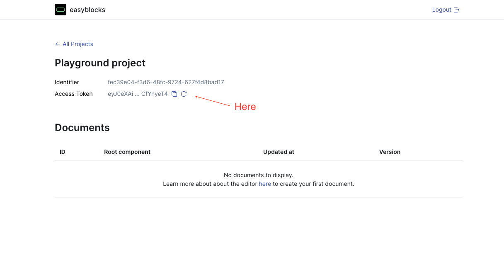

# Getting started

## Quick start

Install the packages:

```bash
npm install @easyblocks/editor @easyblocks/core
```

Create the Editor page:

```typescript
import { EasyblocksEditor } from "@easyblocks/editor";
import { Config, EasyblocksBackend } from "@easyblocks/core";
import { ReactElement } from "react";

const easyblocksConfig: Config = {
  backend: new EasyblocksBackend({
    accessToken: "<<< your access token >>>", // read below how to aquire access token
  }),
  locales: [
    {
      code: "en-US",
      isDefault: true,
    },
    {
      code: "de-DE",
      fallback: "en-US",
    },
  ],
  components: [
    {
      id: "DummyBanner",
      label: "DummyBanner",
      schema: [
        {
          prop: "backgroundColor",
          label: "Background Color",
          type: "color",
        },
        {
          prop: "padding",
          label: "Pading",
          type: "space",
        },
        {
          prop: "Title",
          type: "component",
          required: true,
          accepts: ["@easyblocks/rich-text"],
        },
      ],
      styles: ({ values }) => {
        return {
          styled: {
            Root: {
              backgroundColor: values.backgroundColor,
              padding: values.padding,
            },
          },
        };
      },
    },
  ],
  tokens: {
    colors: [
      {
        id: "black",
        label: "Black",
        value: "#000000",
        isDefault: true,
      },
      {
        id: "white",
        label: "White",
        value: "#ffffff",
      },
      {
        id: "coral",
        label: "Coral",
        value: "#ff7f50",
      },
    ],
    fonts: [
      {
        id: "body",
        label: "Body",
        value: {
          fontSize: 18,
          lineHeight: 1.8,
          fontFamily: "sans-serif",
        },
        isDefault: true,
      },
      {
        id: "heading",
        label: "Heading",
        value: {
          fontSize: 24,
          fontFamily: "sans-serif",
          lineHeight: 1.2,
          fontWeight: 700,
        },
      },
    ],
    space: [
      {
        id: "0",
        label: "0",
        value: "0px",
        isDefault: true,
      },
      {
        id: "1",
        label: "1",
        value: "1px",
      },
      {
        id: "2",
        label: "2",
        value: "2px",
      },
      {
        id: "4",
        label: "4",
        value: "4px",
      },
      {
        id: "6",
        label: "6",
        value: "6px",
      },
      {
        id: "8",
        label: "8",
        value: "8px",
      },
      {
        id: "12",
        label: "12",
        value: "12px",
      },
      {
        id: "16",
        label: "16",
        value: "16px",
      },
      {
        id: "24",
        label: "24",
        value: "24px",
      },
      {
        id: "32",
        label: "32",
        value: "32px",
      },
      {
        id: "48",
        label: "48",
        value: "48px",
      },
      {
        id: "64",
        label: "64",
        value: "64px",
      },
      {
        id: "96",
        label: "96",
        value: "96px",
      },
      {
        id: "128",
        label: "128",
        value: "128px",
      },
      {
        id: "160",
        label: "160",
        value: "160px",
      },
    ],
  },
  hideCloseButton: true,
};

export function DummyBanner(props: {
  Root: ReactElement;
  Title: ReactElement;
}) {
  const { Root, Title } = props;

  return (
    <Root.type {...Root.props}>
      <Title.type {...Title.props} />
    </Root.type>
  );
}

export default function EasyblocksEditorPage() {
  return (
    <EasyblocksEditor config={easyblocksConfig} components={{ DummyBanner }} />
  );
}
```

### Get access token

Easyblocks configuration object requires a `backend` property. Backend is responsible for handling documents and templates saving, updating, versioning etc. The easiest way to start is to use our simple and free cloud service. Just go to [https://app.easyblocks.io](https://app.easyblocks.io), create the account, go to the "Playground project", copy your access token:

<figure><figcaption></figcaption></figure>

Place your token in a constructor of `EasyblocksBackend` class and you're ready to go.

**We're not forcing you to use our cloud.** Easyblocks is open-source and you can easily create your own backend later to control where and how your data is stored. You can learn more about this in [Backend](essentials/backend.md) guide.

### Open the editor

Now you can visit the editor page: `https//localhost:3000/easyblocks-editor?rootComponent=DummyBanner`

Congratulations!

## Real-world example

The example above is very rudimentary. In order to see Easyblocks at a full power you should have at least a few No-Code Components, custom types, etc.&#x20;

We highly recommend cloning our [Page Builder Example](https://github.com/easyblockshq/page-builder-demo) to play around with a real-world configuration.

You can use `EasyblocksBackend` with your access token in each of those examples easily.
